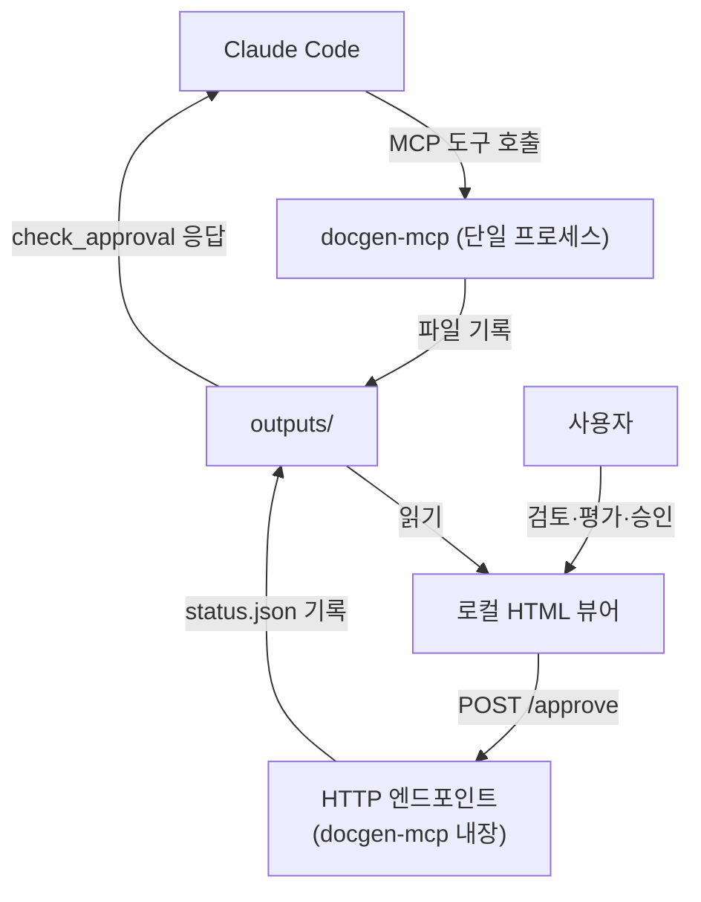
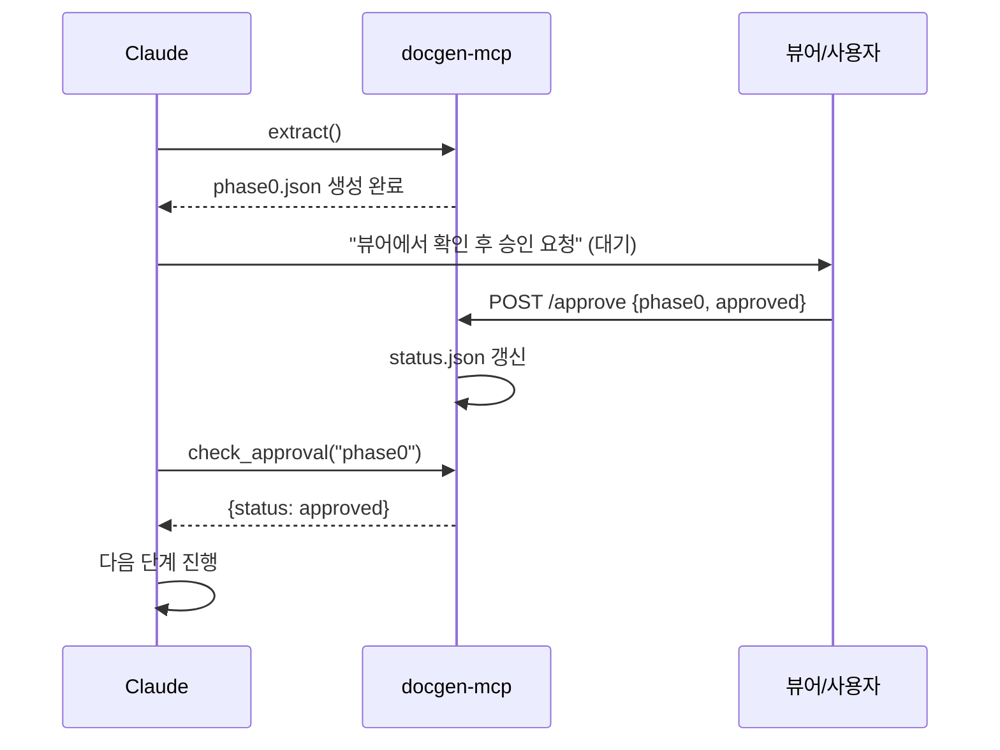

# docgen-mcp 요구사항 명세서

> 소스 코드 문서화를 위한 단일 MCP 서버 + 로컬 뷰어의 기능·비기능 요구사항을 정의한다.
> 본 문서는 구현 착수 전 합의 기준이며, 미확정 항목은 §9에 별도 표기한다.

---

## 1. 개요

### 1.1 목적
중규모(50~300 클래스) Java 프로젝트의 소스를 **토큰 효율적·체계적·검증 가능**하게 문서화하기 위한 도구를 정의한다. LLM(Claude Code)이 전체 소스를 컨텍스트에 올리지 않고, 필요한 데이터만 도구 호출로 조회하여 문서를 생성하도록 한다.

### 1.2 설계 원칙
| 원칙 | 내용 | 근거 |
|------|------|------|
| 단일 책임 분리 | MCP=데이터, 뷰어=표시·승인 | MCP 프로토콜의 본업은 데이터 반환이며 UI 렌더링은 클라이언트 책임 |
| 토큰 외부화 | 전체 JSON 상주 금지, on-demand 조회 | 컨텍스트 상주량을 도구 호출로 대체 → "prompt too long" 방지 |
| 결정론적 검증 | 환각 여부를 스크립트로 사전 차단 | LLM 사후 검토보다 비용·정확도 우수 |
| 결정론 우선 | 결정론적 산출물을 해석적 산출물보다 먼저 생성 | 검증된 골격에 의미를 붙여 흐름 환각 차단 |
| 의존성 최소화 | 단일 프로세스, 빌드 0, 외부 서비스 0 | 폐쇄망 VDI 제약 충족 |
| 사람-게이트 | 단계별 사용자 승인 후 진행 | 잘못된 산출물의 후속 단계 전파 차단 |

### 1.3 비목표 (Out of Scope)
- SPA 프레임워크 기반 뷰어 (단일 HTML로 충분)
- 인증·세션·관계형 DB 도입 (SQLite 색인 + 파일로 충분)
- 실시간 양방향 동기화(WebSocket) (비동기 폴링으로 충분)
- 단계별 마이크로서비스 분리 (단일 프로세스로 통합)

### 1.4 문서화 레벨 모델 (물리축 ⊥ 기능축)
패키지(물리 위치)와 기능적 응집(논리 묶음)이 어긋나는 구조(예: `settings`·`filter`처럼 종류로 묶인 패키지에서 협력 단위가 흩어지는 경우)를 다루기 위해, 물리 레벨을 보존하되 **기능축(L1.5)을 직교로 추가**한다.

| 레벨 | 조직 단위 | 축 | 보는 것 | 성격 |
|------|-----------|----|---------|------|
| L0 | 패키지 | 물리 | 패키지·의존 골격 | 결정론적 |
| L1 | 클래스 | 물리 | 클래스·시그니처 인벤토리 | 결정론적 |
| **L1.5** | **기능 슬라이스** | **기능(직교)** | **kind를 가로지른 협력 묶음** | 반결정론(자동후보+사람승인) |
| L2 | 슬라이스 | 의미 | 묶음의 동작·흐름 | 해석적 |
| L3 | 슬라이스 | 관계 | 호출/의존 다이어그램 | 결정론적 |

> **근거**: 패키지(kind) 기준만으로는 "AuthSettings와 AuthFilter가 한 팀"이라는 사실이 드러나지 않는다. 이 관계는 `phase0.json`의 `dependencies`·`calls`에서 추론해야 하므로, 이를 자동 클러스터링하는 별도 레이어가 필요하다. 레벨 번호는 추상도 분류이지 제작 순서가 아니다.

---

## 2. 시스템 아키텍처

### 2.1 구성도


### 2.2 프로세스 구성
`docgen-mcp`는 **하나의 프로세스**로 다음 세 가지를 동시 제공한다.

| 채널 | 프로토콜 | 역할 |
|------|----------|------|
| MCP 인터페이스 | stdio (기본) | LLM이 호출하는 6개 도구 노출 |
| HTTP 뷰어 | HTTP (localhost) | `GET /viewer` 정적 HTML, `POST /approve` 승인 기록 |
| 내부 색인 | SQLite (파일) | Phase 0에서 1회 생성, 이후 질의 전용 |

> **근거**: 어차피 상주하는 프로세스가 승인 쓰기까지 담당하면 추가 의존성이 0이 된다. 정적 HTML 단독으로는 파일 쓰기가 불가하므로 HTTP 엔드포인트를 같은 프로세스에 통합한다.

---

## 3. 기능 요구사항 — MCP 도구

### 3.1 도구 목록
| ID | 도구 | LLM 사용 단계 | 부수효과(파일) |
|----|------|---------------|----------------|
| FR-1 | `extract` | Phase 0 | `phase0.json`, SQLite 색인 |
| FR-2 | `verify` | Phase 3b | `mapping.json` |
| FR-3 | `select_complex` | Phase 3a 대상 선별 | (반환만) |
| FR-4 | `get_call_graph` | Phase 3c | (반환만) |
| FR-5 | `check_approval` | 모든 단계 진입 | (읽기만) |
| FR-6 | `cluster_features` | Phase 2.5 | `slices.json` |

### 3.2 FR-1 `extract` — 시그니처 추출
- **입력**: `package`(string, 선택). 미지정 시 전체 1회 추출.
- **처리**: JavaParser로 클래스/메서드 시그니처·어노테이션·호출관계·복잡도 추출 → SQLite 색인 적재 + `phase0.json` 기록.
- **출력**: 해당 패키지의 시그니처 JSON (본문 제외).
- **반환 스키마**: §6.1 참조.
- **요구**: 메서드 **본문은 반환하지 않는다**(토큰 절약). 본문은 Phase 3d에서 별도 조회한다(조회 수단은 §9 OQ-6 참조 — 현 `extract` 시그니처에는 본문 반환 경로가 없음).

### 3.3 FR-2 `verify` — 목차↔소스 매핑 검증
- **입력**: `items`(목차 항목 배열, 각 항목은 `{title, mapped_source}`).
- **처리**: 각 `mapped_source`(FQCN 또는 `Class.method` 시그니처)가 SQLite 색인에 존재하는지 대조.
- **출력**: 항목별 `{title, mapped_source, exists: true|false}` 배열 → `mapping.json` 기록.
- **요구**: **LLM을 사용하지 않는다**(결정론적 대조, 토큰 0). 환각 항목(`exists:false`)을 식별하는 1차 게이트.

### 3.4 FR-3 `select_complex` — L2 대상 선별
- **입력**: `threshold`(`{min_complexity, min_loc}`).
- **처리**: 색인에서 임계값 초과 클래스/메서드 필터.
- **출력**: 대상 엔티티 목록 + 복잡도·LOC.
- **요구**: 전체의 일부(예: 300클래스 → 60~90개)만 반환하여 Phase 3 LLM 투입량을 제한.

### 3.5 FR-4 `get_call_graph` — 호출 관계 조회
- **입력**: `class`(FQCN) 또는 `package`, 또는 `slice`(슬라이스명).
- **처리**: 색인에서 호출/의존 엣지 추출.
- **출력**: 노드·엣지 목록(Mermaid 변환 직전 데이터).
- **요구**: 코드 본문 대신 그래프 데이터만 제공. Phase 3c에서 **내용 작성(3d)보다 먼저** 호출되어 다이어그램 골격을 만든다.
- **슬라이스 해석**: `slice` 입력은 §6.4 `slices.json`(Phase 2.5 **사람 교정이 반영된 최종본**)에서 멤버를 해석한다. 따라서 교정 결과가 `slices.json`에 영속화되어 있어야 한다(영속화 방식은 §9 OQ-8 참조).

### 3.6 FR-5 `check_approval` — 승인 게이트 확인
- **입력**: `phase`(string, 예: `"phase0"`, `"phase3b"`).
- **처리**: `status.json`에서 해당 단계 상태 조회.
- **출력**: `{phase, status: "pending"|"approved"|"rejected"}`.
- **요구**: `approved`가 아니면 LLM은 다음 단계로 진행하지 않는다(§5 게이트 규칙).

### 3.7 FR-6 `cluster_features` — 기능 슬라이스 후보 산출
- **입력**: `options`(선택, `{min_signal_score}`).
- **처리**: 색인의 신호를 점수화하여 패키지 종류(kind)를 가로지르는 협력 묶음 후보를 산출. 신호 우선순위는 §6.5 참조. (1) `calls`/`dependencies` 직접 참조, (2) 명명 어간 공유, (3) 공유 도메인 타입.
- **출력**: 슬라이스 후보 목록 → `slices.json` 기록. 각 슬라이스는 `{slice, members[], signal, cross_package, shared}`.
- **요구**: **자동 후보만 산출**한다(결정론적 점수화). 최종 확정·교정은 Phase 2.5에서 사람이 수행한다. 다중 슬라이스에서 쓰이는 공통 클래스는 `shared:true`로 분리하고, 어디에도 안 묶이는 클래스는 "미분류"로 표기하여 데드코드 후보로 회부한다.
- **단일 원본**: 산출된 `slices.json`은 Phase 2.5 사람 교정의 입력이자 교정 결과가 다시 기록되는 **슬라이스 정의의 단일 원본(source of truth)**이다. 후속 단계(`get_call_graph(slice)`, Phase 3a 목차의 슬라이스 단위 구성)는 이 교정본을 참조한다. 교정 결과의 영속화 방식은 §9 OQ-8 참조.

---

## 4. 기능 요구사항 — 뷰어

### 4.1 형태
- **단일 HTML 파일** (`GET /viewer`로 서빙). 외부 CDN·빌드 체인 불필요(폐쇄망).
- 마크다운 렌더 및 Mermaid 렌더는 인라인 스크립트 또는 사전 번들로 처리(외부 네트워크 미사용).

### 4.2 탭 구성
| 탭 | 표시 내용 | 데이터 소스 |
|----|-----------|-------------|
| Phase 0 | 패키지 트리·클래스 목록 | `phase0.json` |
| Phase 1/2 | 구조·컴포넌트 인덱스(MD 렌더) | `*.md` |
| Phase 2.5 | 기능 슬라이스 매트릭스(기능×종류, 묶음 근거) | `slices.json`, `L1_5-slices.md` |
| Phase 3a/3b | 목차 + 매핑 표(존재 ✓ / 환각 ✗ 강조) | `toc.md`, `mapping.json` |
| Phase 3c | 호출/시퀀스 다이어그램 | `*.mermaid` |
| 진행 현황 | 단계별 승인 상태 + **승인 버튼** | `status.json` |

### 4.3 승인 동작
- 승인 버튼 클릭 → `POST /approve {phase, decision}` → 서버가 `status.json` 갱신.
- 거부 시 `rejected` 기록 → 사유 입력란 제공(선택).
- 뷰어는 폴링(예: 3초)으로 상태 갱신을 반영.

---

## 5. 승인 게이트 메커니즘 (Human-in-the-Loop)

### 5.1 방식 채택
| 방식 | 동작 | 폐쇄망 적합성 | 채택 |
|------|------|:---:|:---:|
| MCP elicitation | 프로토콜 사용자 입력 요청 | 클라이언트 지원 의존 | ✗ |
| **파일 신호 (status.json)** | 뷰어→서버→파일 기록, LLM이 확인 | 파일시스템만 필요 | **✓** |

### 5.2 단계 진행 흐름


### 5.3 게이트 규칙
- LLM은 각 단계 **진입 직전 `check_approval`을 호출**한다.
- 반환이 `approved`가 아니면 **진행 금지·대기**한다.
- 임의 단계 건너뛰기 금지(이전 단계 `approved` 선행 조건).
- 승인 단계키: `phase0`, `phase1`, `phase2`, `phase2_5`, `phase3b`, `phase3c`, `phase3d`.
- **Phase 3a(목차)는 독립 승인 게이트를 갖지 않는다.** 목차는 3a↔3b 반복으로 모든 매핑이 `✓`가 된 뒤 **`phase3b` 게이트에서 함께 승인**된다(미검증 목차의 단독 승인 방지). 가이드라인 §1 흐름도·§10 DoD와 일치.

---

## 6. 데이터 모델

### 6.1 `phase0.json` (엔티티당 레코드)
```json
{
  "package": "com.example.order",
  "class": "OrderService",
  "stereotype": "@Service",
  "annotations": ["@Transactional"],
  "methods": [
    {
      "sig": "OrderResponse create(OrderRequest)",
      "loc": 45,
      "complexity": 8,
      "calls": ["OrderRepository.save", "PaymentClient.charge"]
    }
  ],
  "dependencies": ["OrderRepository", "PaymentClient"]
}
```
- `complexity`·`loc`: FR-3 선별 기준.
- `calls`·`dependencies`: FR-4 다이어그램 연료 및 FR-6 클러스터링 신호.

### 6.2 `mapping.json` (FR-2 산출)
```json
[
  {"title": "주문 생성 흐름", "mapped_source": "OrderService.create", "exists": true},
  {"title": "재고 차감",     "mapped_source": "StockService.deduct",  "exists": false}
]
```

### 6.3 `status.json` (승인 상태)
```json
{
  "phase0":   "approved",
  "phase1":   "approved",
  "phase2":   "approved",
  "phase2_5": "pending",
  "phase3b":  "pending",
  "updated_at": "2026-06-16T09:00:00Z"
}
```

### 6.4 `slices.json` (FR-6 산출)
```json
[
  {"slice": "인증",       "members": ["AuthSettings", "AuthFilter", "AuthProvider"], "signal": "calls",          "cross_package": true,  "shared": false},
  {"slice": "레이트리밋", "members": ["RateLimitSettings", "RateLimitFilter"],       "signal": "naming+calls",   "cross_package": true,  "shared": false},
  {"slice": "(공유)",     "members": ["LogSettings"],                                "signal": "multi-use",      "cross_package": false, "shared": true},
  {"slice": "(미분류)",   "members": ["LegacyHelper"],                               "signal": "none",           "cross_package": false, "shared": false}
]
```
- `cross_package`: 패키지 경계를 가로지르는 묶음 여부.
- `shared`: 다중 슬라이스에서 쓰이는 공통 클래스(별도 분리).
- `signal=none`: 미분류 → 데드코드 후보로 L1 평가에 회부.

### 6.5 산출물 디렉터리 구조
```
outputs/
├─ phase0.json        # FR-1 추출 결과
├─ index.sqlite       # 내부 색인 (질의 전용)
├─ L0-structure.md    # Phase 1 구조 문서
├─ L1-components.md   # Phase 2 컴포넌트 인덱스
├─ slices.json        # FR-6 슬라이스 후보
├─ L1_5-slices.md     # Phase 2.5 기능 슬라이스 매트릭스
├─ toc.md             # Phase 3a 목차
├─ mapping.json       # Phase 3b 매핑 검증
├─ L3-<slice>.mermaid # Phase 3c 다이어그램(슬라이스별, 내용보다 먼저)
├─ L2-<slice>.md      # Phase 3d 의미 문서(슬라이스별)
└─ status.json        # 승인 상태
```

---

## 7. 비기능 요구사항

| ID | 항목 | 요구 | 근거 |
|----|------|------|------|
| NFR-1 | 폐쇄망 동작 | 외부 네트워크 0, 사전 번들만 사용 | VDI 폐쇄망·ax portal 경유 환경 |
| NFR-2 | 의존성 | 단일 프로세스, 런타임 빌드 0 | 배포·유지 단순화 |
| NFR-3 | 추출 1회성 | `extract` 1회 후 질의 N회 | 토큰·시간 절약 |
| NFR-4 | 멱등성 | 동일 입력 재실행 시 동일 산출 | 재현성 확보 |
| NFR-5 | 내결함성 | MCP 중단 시에도 `outputs/` 파일로 결과 확인 가능 | 느슨한 결합 |
| NFR-6 | 가시성 | 모든 산출물은 파일 + 뷰어로 확인 | 사용자 평가·승인 전제 |

---

## 8. 인터페이스 명세 요약

| 도구 | 입력 | 출력 | LLM | 파일 기록 |
|------|------|------|:---:|-----------|
| `extract(package?)` | 패키지명(선택) | 시그니처 JSON | ✗ | `phase0.json`, 색인 |
| `verify(items[])` | 목차-소스 매핑 배열 | 존재 검증 배열 | ✗ | `mapping.json` |
| `select_complex(threshold)` | 복잡도·LOC 임계값 | 대상 엔티티 목록 | ✗ | — |
| `get_call_graph(class\|package\|slice)` | 클래스/패키지/슬라이스 | 노드·엣지 | ✗ | — |
| `check_approval(phase)` | 단계명 | 승인 상태 | ✗ | — |
| `cluster_features(options?)` | 신호 임계값(선택) | 슬라이스 후보 | ✗ | `slices.json` |

> 6개 도구 **전부 LLM을 내부에서 사용하지 않는다**. LLM은 도구의 출력을 받아 문서를 작성하는 주체이며, 도구 자체는 결정론적이다.

---

## 9. 미확정 항목 (착수 전 결정 필요)

| 번호 | 항목 | 선택지 | 영향 |
|------|------|--------|------|
| OQ-1 | 구현 언어 | (a) JVM: Java/Kotlin MCP SDK + JavaParser 직접 / (b) Node: tree-sitter-java(타입해석 일부 양보) | 추출 정확도·SDK 선택 |
| OQ-2 | HTTP 뷰어 포함 | 포함(권장) / 미포함(File System Access API로 대체) | 승인 쓰기 방식 |
| OQ-3 | MCP 전송 | stdio(기본) / SSE | ax portal 경유 가능성 |
| OQ-4 | 복잡도 임계값 | `min_complexity`, `min_loc` 구체값 | Phase 3a 투입량 |
| OQ-5 | 슬라이스 신호 가중치 | 직접참조/명명/공유타입 점수 비율, `min_signal_score` | 슬라이스 후보 정밀도 |
| OQ-6 | 메서드 본문 조회 방식 | (a) `extract` 확장(`class`/`method`/`include_body` 인자 추가) / (b) 별도 도구 `get_source` 신설 | Phase 3d 본문 조회 인터페이스. 현 `extract`는 본문 미반환(FR-1)이라 3d 실행 경로가 비어 있음 |
| OQ-7 | L0/L1 자동 생성 주체 | (a) docgen-mcp 내장 생성기(FR 추가, `phase0.json`→`L0/L1.md` 투영) / (b) 별도 CLI 스크립트 | Phase 1/2 산출 책임 정의. 현 추적성표의 "(스크립트)"는 6개 도구·뷰어 어디에도 속하지 않음. NFR-2(빌드 0)·의존성 최소화 정합 |
| OQ-8 | Phase 2.5 슬라이스 교정 영속화 | (a) 뷰어 편집 엔드포인트(`POST /slices`로 `slices.json` 갱신) / (b) `slices.json` 수동 편집 후 재적재 | 사람 교정이 `get_call_graph(slice)` 등 도구에 반영되는 경로. 현 뷰어는 `POST /approve`만 보유 |

> **권장 기본값**: OQ-1=(a) JVM[타입 해석 필수], OQ-2=포함, OQ-3=stdio, OQ-4·OQ-5=프로젝트 분포 측정 후 결정, OQ-6=(a) `extract` 확장[도구 수 6개 유지], OQ-7=(a) 내장 생성기[단일 프로세스·의존성 0 유지], OQ-8=(a) 뷰어 엔드포인트[승인과 동일 채널로 일관].

---

## 10. 추적성 (요구사항 ↔ 단계)

| 단계 | 레벨 | 사용 도구 | 산출물 | 승인 단계키 |
|------|------|-----------|--------|-------------|
| Phase 0 추출 | — | `extract` | `phase0.json`, 색인 | `phase0` |
| Phase 1 구조 | L0 | (스크립트) | `L0-structure.md` | `phase1` |
| Phase 2 인덱스 | L1 | (스크립트) | `L1-components.md` | `phase2` |
| Phase 2.5 슬라이스 | L1.5 | `cluster_features` | `slices.json`, `L1_5-slices.md` | `phase2_5` |
| Phase 3a 목차 | — | `select_complex` | `toc.md` | (phase3b로 통합) |
| Phase 3b 매핑·검증 | — | `verify` | `mapping.json` | `phase3b` |
| Phase 3c 다이어그램 | L3 | `get_call_graph` | `L3-<slice>.mermaid` | `phase3c` |
| Phase 3d 내용 | L2 | 본문 조회 도구(§9 OQ-6) | `L2-<slice>.md` | `phase3d` |

> **순서 주의**: Phase 3은 목차(3a) → 매핑검증(3b) → **다이어그램(3c)** → 내용(3d) 순이다. 결정론적 산출물(매핑·그래프)을 해석적 산출물(내용)보다 먼저 확정하여, 내용 작성 시 검증된 다이어그램을 임베드하고 흐름 환각을 차단한다. 기존 "Phase 4 다이어그램"은 Phase 3c로 흡수되었다.
