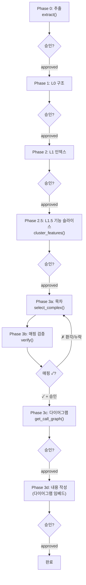

# 문서화 절차 LLM 가이드라인

> 본 문서는 **소스 문서화를 수행하는 LLM(Claude Code)**이 따라야 할 작업 절차·규칙·템플릿을 정의한다.
> `docgen-mcp` 서버(요구사항: `docgen-mcp-requirements.md`)와 함께 사용한다. 본 가이드라인은 "LLM이 무엇을, 어떤 순서로, 무엇을 금지하며 수행하는가"를 규정한다.

---

## 0. 최우선 원칙 (Always)

| 원칙 | 규칙 | 위반 시 결과 |
|------|------|--------------|
| 승인 게이트 | 각 단계 진입 전 `check_approval` 호출, `approved`가 아니면 **대기** | 미검증 산출물의 후속 전파 |
| 근거 명시 | 모든 판단은 `phase0.json`의 어떤 필드에서 도출됐는지 표기 | 추적 불가·환각 |
| 결정론 우선 | 결정론적 산출물(매핑·그래프)을 해석적 산출물(내용)보다 먼저 생성 | 흐름 환각·재작업 |
| 토큰 외부화 | 전체 소스를 컨텍스트에 올리지 않고 도구로 조회 | "prompt too long" |
| 환각 금지 | 색인에 없는 클래스/메서드는 문서화하지 않음 | 허위 문서 |
| 단계 불건너뜀 | 이전 단계 `approved` 없이는 진행 금지 | 검증 누락 |

> **핵심**: LLM은 "코드를 읽는 주체"가 아니라 "도구가 준 데이터를 문서로 변환하는 주체"다. 코드 본문은 Phase 3d에서 선별된 클래스에 한해서만 조회한다.

---

## 1. 전체 절차 개요



| 단계 | 레벨 | LLM 역할 | 도구 | 토큰 수준 |
|------|------|----------|------|:---:|
| Phase 0 | — | 추출 트리거만 | `extract` | 0 |
| Phase 1 | L0 | (스크립트 생성, LLM 검수) | — | 낮음 |
| Phase 2 | L1 | (스크립트 생성, LLM 검수) | — | 낮음 |
| Phase 2.5 | L1.5 | 슬라이스 후보 검토·교정 | `cluster_features` | 낮음 |
| Phase 3a | — | 목차 작성(슬라이스 단위) | `select_complex` | 중간 |
| Phase 3b | — | 매핑 표 작성·검증 | `verify` | 낮음 |
| Phase 3c | L3 | 그래프→Mermaid 변환 | `get_call_graph` | 중간 |
| Phase 3d | L2 | 의미 내용 작성 | `extract`(본문) | 높음 |

> **순서 변경 핵심**: 다이어그램(3c)이 내용(3d)보다 **앞**이다. 결정론적 골격을 먼저 확정한 뒤, 내용 작성 시 그 다이어그램을 임베드하므로 흐름을 새로 추정하지 않는다. 기존 "Phase 4 다이어그램"은 3c로 흡수되었다.

---

## 2. Phase 0 — 추출

### 수행
1. `check_approval("phase0")`로 직전 승인 여부 확인(최초엔 사용자 지시로 시작).
2. `extract()` 호출(전체 1회). 결과는 `phase0.json` + 색인에 적재됨.
3. 산출물이 생성됐음을 사용자에게 알리고, **뷰어 확인·승인 요청 후 대기**.

### 금지
- 추출 JSON 전체를 컨텍스트에 펼쳐 요약 시도 금지(토큰 낭비). 이후 단계는 필요한 패키지만 조회한다.

---

## 3. Phase 1 / 2 — 구조·인덱스 (자동 생성 + 평가)

L0(`L0-structure.md`)·L1(`L1-components.md`)은 **스크립트가 `phase0.json`에서 자동 생성**한다(결정론적 투영). LLM은 생성물의 **누락·오표기만 검수**하며, 전체 재작성은 금지한다.

### 3.1 구성 기준 (무엇으로 채우는가)

**L0 구조 문서**
| 구성 요소 | 출처 필드 | 표현 |
|-----------|-----------|------|
| 패키지/모듈 트리 | `package` | 계층 트리 |
| 패키지 간 의존 그래프 | `dependencies`(패키지 합산) | Mermaid `graph` |
| 계층 분류(Controller/Service/Repository) | `stereotype` | 분류 표 |
| 순환 의존·계층 위반 플래그 | `dependencies` 분석 | 경고 표시 |

**L1 컴포넌트 인덱스**
| 구성 요소 | 출처 필드 | 표현 |
|-----------|-----------|------|
| 클래스 인벤토리 | `class`,`package`,`stereotype` | 표(클래스\|패키지\|역할\|메서드수\|의존수) |
| 어노테이션 분류 | `annotations`,`stereotype` | 분류 표 |
| public 메서드 시그니처 | `methods[].sig` | 시그니처 목록(**본문 제외**) |
| 역할 미상 클래스 플래그 | `stereotype`·`annotations` 부재 | 미상 표기 |

> L0=숲(패키지·의존 골격), L1=나무 목록(클래스·시그니처 인벤토리, 본문 제외).

### 3.2 평가 기준 (게이트에서 무엇을 보는가)

결정론적 산출물이므로 평가가 **기계(자동 대조)**와 **사람(설계 의도)**으로 분리된다. 완전성·정합성은 `phase0.json` 대조로 결정 가능하고, "의도된 의존인가/데드코드인가"는 추출 데이터에 없는 설계 지식이므로 사람만 판단한다.

**L0 평가 기준**
| 차원 | 기준 | 검증 주체 |
|------|------|:---:|
| 완전성 | 전 패키지가 트리에 존재 | 기계 |
| 정합성 | 의존 엣지 = `dependencies` 합산과 일치 | 기계 |
| 이상 탐지 | 순환 의존·계층 위반이 플래그됨 | 기계 |
| 아키텍처 부합 | 의도한 구조와 일치, 예상외 의존 없음 | **사람** |
| 데드코드 식별 | 고립·미사용 패키지 판단 | **사람** |

**L1 평가 기준**
| 차원 | 기준 | 검증 주체 |
|------|------|:---:|
| 완전성 | 전 클래스·public 메서드가 인덱스에 존재 | 기계 |
| 분류 정확성 | 스테레오타입 매핑이 정확 | 기계 |
| 누락 플래그 | 역할 미상 클래스 표기 | 기계 |
| 명명 적절성 | 클래스·메서드명이 역할을 반영 | **사람** |
| 범위 적정성 | 문서화 대상 누락/과다 여부 | **사람** |

> 사용자는 산문 품질이 아니라 **"이게 내 시스템의 실제 모습이 맞는가"**만 확인한다. 그래서 L0/L1 게이트는 가볍다.

### 3.3 근거 표기 예시
> "OrderService는 `@Service` 스테레오타입과 `@Transactional` 어노테이션(`phase0.json: stereotype, annotations`)에 근거하여 '트랜잭션 경계를 갖는 서비스 계층'으로 분류함."

---

## 4. Phase 2.5 — 기능 슬라이스 (L1.5, 직교 레이어)

> **목적**: 패키지(kind) 기준만으로는 `settings`·`filter`처럼 종류로 묶인 패키지에서 협력 단위(예: 인증=AuthSettings+AuthFilter)가 흩어져 드러나지 않는다. 물리 레벨(L0/L1)을 보존하되 **기능축을 직교로 추가**하여, L2를 패키지가 아닌 슬라이스 단위로 작성할 토대를 만든다.

### 4.1 수행
1. `cluster_features()`로 슬라이스 후보(`slices.json`) 산출.
2. 후보를 **슬라이스 매트릭스**로 정리(§4.4).
3. 사람이 검토·교정(자동 신호가 못 잡는 도메인 묶음 추가/분리) 후 **승인 요청·대기**(`phase2_5`).

### 4.2 슬라이스 식별 기준 (우선순위 신호)
| 우선순위 | 신호 | 판정 | 주체 |
|:---:|------|------|:---:|
| 1 | `calls`/`dependencies` 직접 참조 | AuthFilter→AuthSettings 참조 = 강한 묶음 | 기계 |
| 2 | 명명 어간 공유 | `Auth*`, `RateLimit*` 접두 일치 | 기계 |
| 3 | 공유 도메인 타입 | 같은 DTO/enum 함께 사용 | 기계 |
| 4 | 도메인 의미 | 명명·참조 없어도 사람이 아는 한 팀 | **사람** |

> 1~3은 자동 후보(토큰 0), 4는 사람 교정. "결정론 먼저, 해석 나중" 원칙과 일관.

### 4.3 다대다·경계 처리 규칙
| 상황 | 처리 |
|------|------|
| 단일 묶음 소속 | 해당 슬라이스에 귀속 |
| 다중 묶음 사용(예: 공통 `LogSettings`) | `shared:true`로 분리, 각 슬라이스는 "의존"으로 참조 |
| 경계 모호 | 1~3 신호 점수화 후 임계값, 미달은 사람 판정 |
| 고립(어디에도 안 묶임) | "미분류" 표기 → 데드코드 후보로 L1 평가에 회부 |

> 가로지르는 공유 컴포넌트를 무리하게 한 묶음에 욱여넣지 않는다.

### 4.4 슬라이스 매트릭스 템플릿
행=기능(논리), 열=패키지 종류(물리)로 두 축을 동시에 보인다. `L1_5-slices.md`에 기록.

| 기능 슬라이스 | settings 측 | filter 측 | 기타 | 묶음 근거 |
|---------------|-------------|-----------|------|-----------|
| 인증 | AuthSettings | AuthFilter | AuthProvider | calls(직접참조) |
| 레이트리밋 | RateLimitSettings | RateLimitFilter | — | 명명어간+참조 |
| 로깅 | LogSettings | LogFilter | — | 명명어간 |
| (공유) | LogSettings* | — | — | 다중 슬라이스 사용 |

### 금지
- 자동 후보를 그대로 확정하지 않는다(사람 교정 필수).
- 슬라이스 미확정 상태에서 Phase 3a 목차 작성 금지.

---

## 5. Phase 3 — 의미 문서 (목차 → 매핑 → 다이어그램 → 내용)

> **분리·순서 이유**: 목차 단계에서 항목↔소스 매핑을 강제해 실재 엔티티만 다루는지 검증하고, 다이어그램(결정론적 골격)을 내용(해석)보다 먼저 확정해 흐름 환각을 차단한다. 모든 작업은 **슬라이스 단위**로 수행한다.

### 5.1 Phase 3a — 목차 생성
1. `select_complex({min_complexity, min_loc})`로 L2 대상 엔티티 목록 확보.
2. **슬라이스 단위**로 목차(`toc.md`) 작성. **각 목차 항목에 매핑 소스를 함께 기재**한다.

목차 항목 형식:
```markdown
## {슬라이스명}
- {문서 항목 제목}  → 매핑: {FQCN 또는 Class.method}
```

### 5.2 Phase 3b — 소스 매핑 검증
1. 목차의 모든 `(제목, 매핑소스)`를 `verify(items[])`에 전달.
2. 반환된 `mapping.json`을 검토하여 매핑 표 작성:

| 문서 항목 | 매핑 소스 | 존재 | 조치 |
|-----------|-----------|:---:|------|
| 주문 생성 흐름 | `OrderService.create` | ✓ | 유지 |
| 재고 차감 | `StockService.deduct` | ✗ | **제거**(환각) |

3. **검증 규칙**:
   - `exists:false` 항목은 목차에서 제거하거나 올바른 소스로 수정 → Phase 3a로 되돌아감.
   - 모든 항목이 `✓`가 될 때까지 3a↔3b 반복.
   - 통과 후 **승인 요청·대기**(`phase3b`).

### 5.3 Phase 3c — 다이어그램 (내용보다 먼저)
1. `get_call_graph(slice|class|package)`로 노드·엣지 데이터 확보.
2. 데이터를 **Mermaid로 변환**하여 `L3-<slice>.mermaid` 생성(코드 본문 재로드 금지).
3. 작성 후 승인 요청·대기(`phase3c`).

다이어그램 선택 기준:
| 표현 대상 | 다이어그램 |
|-----------|-----------|
| 클래스 간 호출 흐름 | `sequenceDiagram` |
| 패키지·의존 구조 | `graph` (flowchart) |
| 상태 전이 | `stateDiagram` |

> 다이어그램을 먼저 만들면 3d 내용 작성 시 "코드가 이렇게 흐른다"고 새로 추정하지 않고, **검증된 그림이 보여주는 것을 서술**한다.

### 5.4 Phase 3d — 내용 작성
1. 승인된 목차 항목에 한해, 해당 클래스 **본문을 `extract`로 개별 조회**(전체가 아닌 확정분만).
2. **슬라이스 단위**로 `L2-<slice>.md` 작성. §6 템플릿 준수. "핵심 흐름"에는 3c에서 만든 `L3-<slice>.mermaid`를 임베드한다.
3. 작성 후 승인 요청·대기(`phase3d`).

### 금지
- 매핑 미검증 상태에서 내용 작성 금지.
- 다이어그램(3c) 미완 상태에서 내용 작성 금지.
- 한 번에 전체 슬라이스 본문 로드 금지(슬라이스 단위 배치, 세션 경계에서 분할).

---

## 6. 문서 템플릿 표준

> 템플릿을 고정하면 LLM이 매번 "형식을 어떻게 쓸지" 추론하는 비용이 사라진다. L2 문서는 아래 형식을 따른다.

```markdown
# {슬라이스명}

## 책임
{1~2문장. 무엇을 담당하는가.}

## 주요 컴포넌트
| 클래스 | 역할 | 근거(어노테이션/시그니처) |
|--------|------|---------------------------|
| ... | ... | ... |

## 핵심 흐름
{3c에서 생성한 L3-<slice>.mermaid 임베드 + 보충 설명}

## 의존성
| 대상 | 방향 | 이유 |
|------|------|------|
| ... | ... | ... |

## 비고
{예외 처리, 트랜잭션 경계, 공유 컴포넌트 참조 등}
```

---

## 7. 출력·형식 규칙

| 규칙 | 내용 |
|------|------|
| 포맷 | 모든 문서는 **마크다운**으로 작성 |
| 시각화 | 메커니즘·구조·흐름은 **표 또는 다이어그램** 우선(산문 나열 지양) |
| 근거 | 분류·판단마다 `phase0.json`의 출처 필드 명시 |
| 간결성 | 도구 출력의 단순 복붙 금지, 의미 단위로 재구성 |
| 파일 위치 | `docgen-mcp-requirements.md` §6.5 디렉터리 구조 준수 |

---

## 8. 토큰 절약 체크리스트 (각 단계 진입 시 자문)

- [ ] 이 작업에 전체 소스가 필요한가, 아니면 특정 슬라이스/패키지만으로 충분한가?
- [ ] 도구로 조회 가능한 데이터를 컨텍스트에 미리 펼치고 있지는 않은가?
- [ ] 메서드 본문이 정말 필요한가(Phase 3d 선별분인가)?
- [ ] 이전 단계 산출물을 통째로 다시 읽지 않고, 요약·인덱스만 참조하는가?
- [ ] 슬라이스 단위로 세션을 끊어 컨텍스트 누적을 방지하는가?

---

## 9. 환각 방지 규칙 (Never)

| 금지 행위 | 대안 |
|-----------|------|
| 색인에 없는 클래스/메서드 서술 | `verify`로 존재 확인 후에만 서술 |
| 어노테이션 추정으로 동작 단정 | 시그니처·어노테이션이 뒷받침하는 범위로 제한 표기 |
| 호출 관계 임의 추정 | `get_call_graph` 데이터에 근거한 엣지만 표기 |
| 슬라이스 자의적 묶음 | `cluster_features` 후보 + 사람 승인에 근거 |
| 매핑 미검증 내용 작성 | Phase 3b 통과 후에만 Phase 3d 수행 |
| 다이어그램 없이 흐름 서술 | Phase 3c 완료 후 그 그림을 서술 |

---

## 10. 단계별 종료 조건 (Definition of Done)

| 단계 | 완료 조건 |
|------|-----------|
| Phase 0 | `phase0.json`·색인 생성 + `phase0` 승인 |
| Phase 1/2 | L0/L1 §3.2 평가 기준(기계+사람) 통과 + 각 승인 |
| Phase 2.5 | 슬라이스 매트릭스 사람 교정 완료 + `phase2_5` 승인 |
| Phase 3a/b | 매핑 표 전 항목 `✓` + `phase3b` 승인 |
| Phase 3c | 슬라이스별 L3 다이어그램 + `phase3c` 승인 |
| Phase 3d | 슬라이스별 L2 문서(다이어그램 임베드) + `phase3d` 승인 |
| 전체 | 모든 단계 `approved` |
